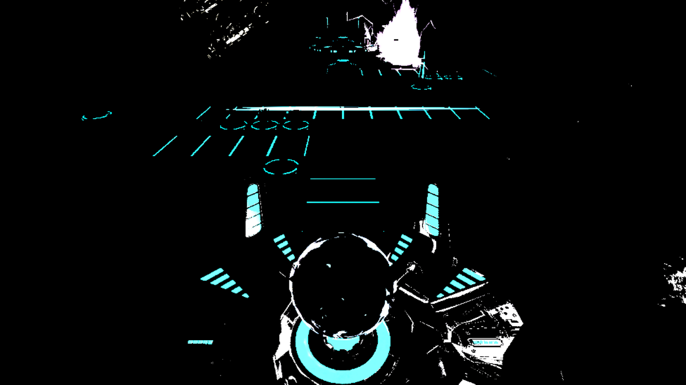

# PlanetBreaker

河原電子ビジネス専門学校
ゲームクリエイター科 2年 好村雄真

# 目次

1.自己紹介

2.作品概要

3.操作説明

4.技術紹介

- PBR
- ブラー
- 川瀬式ブルーム
- エミッションマップ

# 自己紹介

- **元プロゲーマー**
  - 「広島東洋カープ様」や「タケヤ工業株式会社様」「ASUS様」など様々な企業様にスポンサーとして支援して頂きながら、プロゲーマーとして活動していました。
  
  
  
- **性格**
  - 非常にポジティブで何事も前向きに考え、積極的に取り組むことが出来ます。ボランティアや学校行事には可能な限り全て参加し、リーダーとして統率を任される事も多々あります。
- **趣味**
  - ゲーム
    - 幼少の頃から、自由時間の大半、時間で言うと5万時間以上はアナログデジタル問わずゲームに費やしてきました。ゲームを好きな気持ちは誰にも負けないと自負しています。
  - 旅行
      - プロゲーマーとして国内外問わず様々な場所で活動をしていくうちに、地域の文化に直接触れる事の出来る楽しさを知り、現在は2か月に1度ほどのペースで旅行をしています。

# 作品概要

- **使用ゲームエンジン**
  - 学内内製エンジン(DirectX12)を拡張して使用

- **使用ツール**
  - Visual Studio 2022
  - 3ds Max 2022
  - Blender
  - Adobe Photoshop
  - Git Hub
  - Render Doc

- **使用言語**
- C++
- HLSL

- **開発環境**  
  - Windows10
  - DirectX12

- **開発人数**
  - 1人

- **開発期間**
  - エンジン 　2022年9月～11月
  - インゲーム　2022年11月～現在

- **Git Hub**
  - (https://github.com/YuMild/YuMild.Engine.git)

# 操作説明

- LRボタンでウィンドウを表示させ、配置するタレットを選択し、十字キーで移動、LR2ボタンで回転、Aボタンで配置します。
- 配置したタレットを削除するには、LRボタンを二回押し、削除したいタレットを選択し、削除します。

# 技術紹介

- **PBR**  
  光の反射や屈折などの現象を、物理的な根拠に基づいて計算する手法の事です。現エンジンでは、フレネル反射を考慮し、拡散反射を求め、鏡面反射はCook-Torranceモデルで計算しています。
  - 【フレネル反射】
    - 法線、光源に向かうベクトル、視線に向かうベクトルから、法線と光の入射角を求め、入射角の角度に応じて拡散反射光の強さを計算しています。
  - 【Cook-Trranceモデル】
    - Cook-Trranceモデルに関しては著者清原隆行「HLSLシェーダーの魔導書」からコードを引用しています。

- **ブラー**  
  基準となるテクセル＋周りの8テクセルをサンプリングしてカラーを加算し、9で除算してボカしを表現しています。

- **川瀬式ブルーム**  
  光が溢れ出している様に見える現象です。  
  - **シーンを一度レンダリングします**  

  - **レンダリングしたシーンの輝度をテクスチャとして抽出します**  

  - **抽出した輝度テクスチャにブラーを掛けてぼかします**  

  - **ブラーを掛けてぼかした輝度テクスチャをメインレンダリングターゲットに加算合成して完成です**  

- **エミッションマップ**  
  自己発光させたい場所に色を塗ったテクスチャで自己発光を表現します。  
  UFOの上部、宇宙船の青い箇所、画面上部の宇宙ステーション、地球の都市部分にエミッションマップを使用しています。
  - **0.0（エミッション無し）**  

  - **5.0（実際にゲームで使用している強度）**  

  - **20.0（過度に強くした強度）**  

  
**PlanetBreakerの紹介は以上です。**